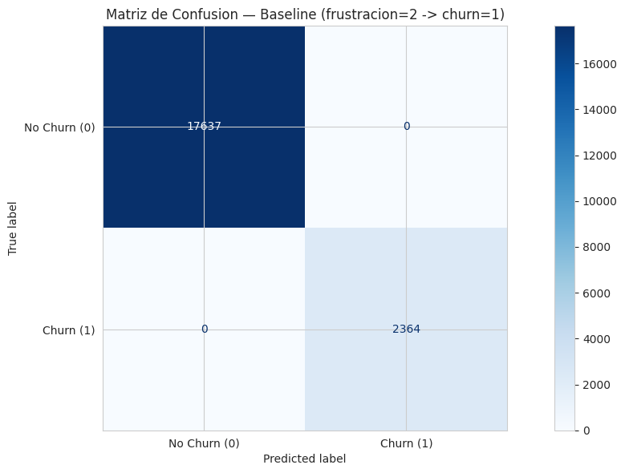
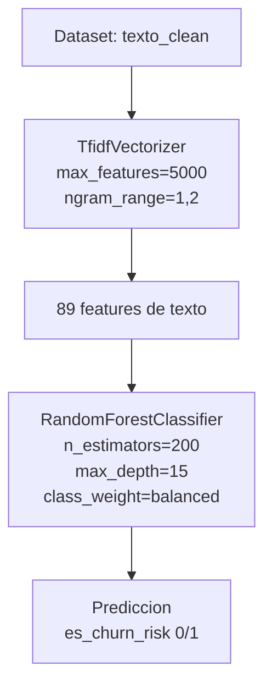
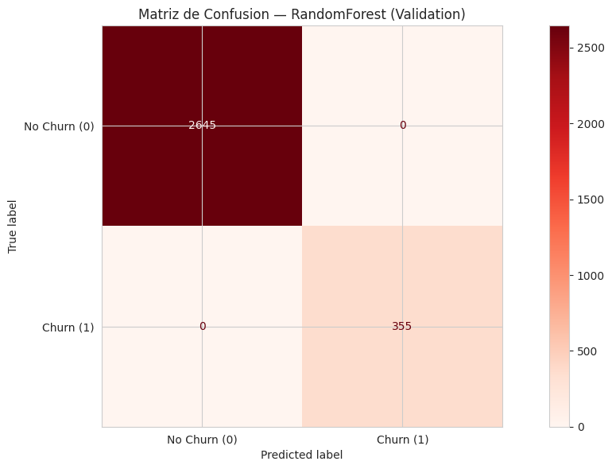
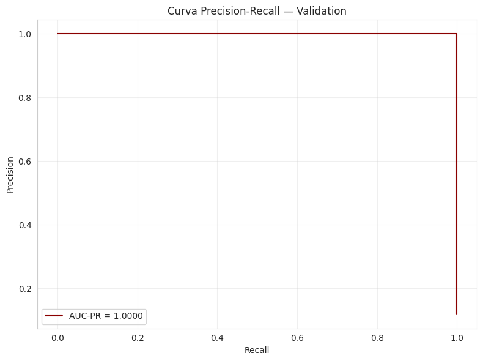
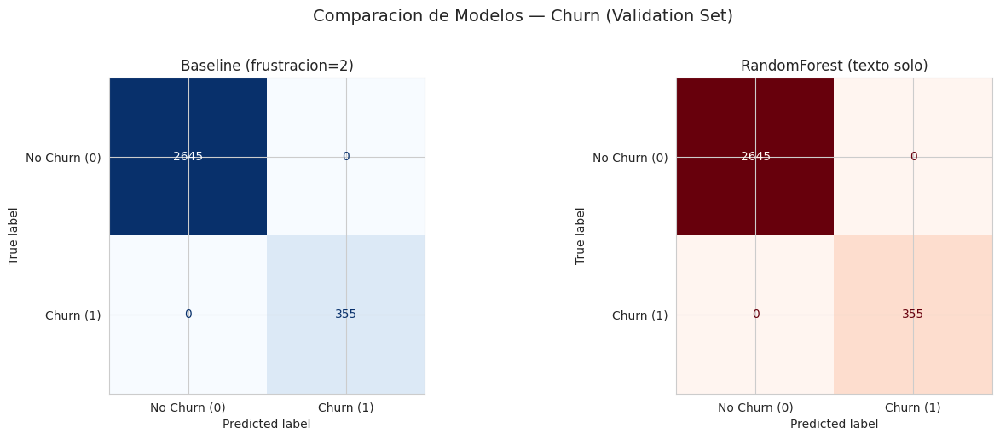
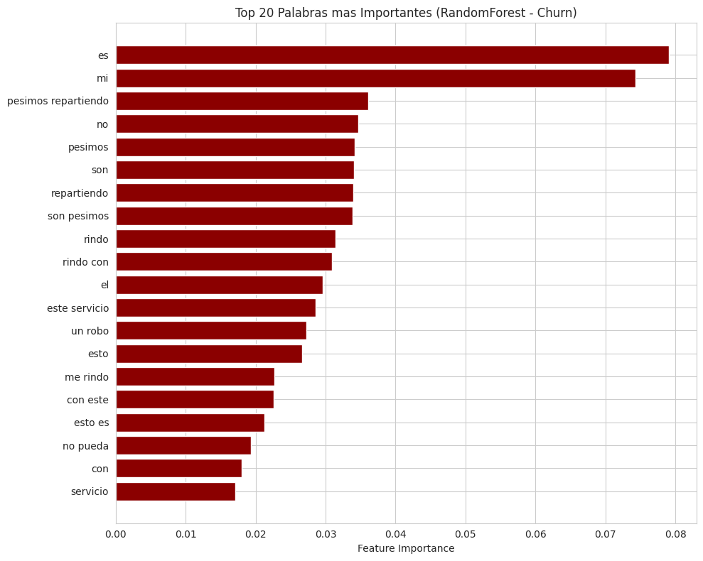

# Churn Model Report — Churn Risk Prediction

**Proyecto:** ConversaAI — Sentiment & Intent Analysis
**Notebook:** 04-churn-model.ipynb
**Target:** es_churn_risk (0: No Churn, 1: Churn)

---

## Resumen

Se entreno un modelo supervisado de clasificacion binaria para predecir `es_churn_risk` a partir del texto del usuario (`texto_clean`) y se comparo contra un baseline deterministico que usa la regla `nivel_frustracion=2 -> churn=1`. El objetivo fue determinar si el contenido textual es suficiente para detectar riesgo de abandono sin conocer el nivel de frustracion.

**Resultado principal:** Tanto el baseline deterministico (frustracion=2) como el modelo RandomForest + TF-IDF (texto solo) alcanzan **100% de accuracy** en todos los splits, con F1-weighted = 1.0000, AUC-PR = 1.0000 (test) y validacion cruzada 5-fold de 1.0000 +/- 0.0000. El texto solo es suficiente para detectar churn con exactitud perfecta.

---

## 1. Verificacion de la Relacion Deterministica

Del EDA se identifico que `es_churn_risk=1` coincide exactamente con `nivel_frustracion=2`:

| Metrica | Valor |
|---------|-------|
| frustracion=2 | 2,364 |
| churn=1 | 2,364 |
| frust=2 AND churn=1 | 2,364 |
| Coincidencia (frust=2 -> churn=1) | 100.00% |
| Coincidencia (churn=1 -> frust=2) | 100.00% |

**Conclusion:** La relacion es perfecta y deterministica. No existe churn sin frustracion alta, ni frustracion alta sin churn.

### Split estratificado 70/15/15

Se aplico un split estratificado en dos etapas, manteniendo indices para mapear de vuelta al DataFrame original:

| Split | Filas | % Churn |
|-------|-------|---------|
| Train | 14,000 | 11.8% |
| Val | 3,000 | 11.8% |
| Test | 3,001 | 11.8% |
| Global | 20,001 | 11.8% |

---

## 2. Baseline Deterministico

Regla simple: `frustracion=2 -> churn=1`.



| Metrica | Resultado |
|---------|-----------|
| Accuracy | 100.00% |
| F1-weighted | 1.0000 |
| F1-macro | 1.0000 |

**Reporte de clasificacion:**

| Clase | Precision | Recall | F1-score | Soporte |
|-------|-----------|--------|----------|---------|
| No Churn (0) | 1.00 | 1.00 | 1.00 | 17,637 |
| Churn (1) | 1.00 | 1.00 | 1.00 | 2,364 |
| **Accuracy** | | | **1.00** | **20,001** |
| Macro avg | 1.00 | 1.00 | 1.00 | 20,001 |
| Weighted avg | 1.00 | 1.00 | 1.00 | 20,001 |

---

## 3. Pipeline Supervisado

Arquitectura identica a los modelos anteriores pero con `class_weight='balanced'` para manejar el desbalanceo (11.8% churn).



### Detalles de componentes

**TfidfVectorizer:**

| Parametro | Valor |
|-----------|-------|
| ngram_range | (1, 2) — unigramas y bigramas |
| max_features | 5,000 |
| max_df | 0.95 |
| min_df | 5 |
| stop_words | None (texto_clean ya normalizado) |

**RandomForestClassifier:**

| Parametro | Valor |
|-----------|-------|
| n_estimators | 200 |
| max_depth | 15 |
| class_weight | balanced |
| random_state | 42 |
| n_jobs | -1 |

**Dimensiones resultantes:** 89 features TF-IDF

---

## 4. Entrenamiento y Validacion

### Evaluacion en validation set





| Metrica | Resultado |
|---------|-----------|
| Accuracy | 100.00% |
| F1-weighted | 1.0000 |
| F1-macro | 1.0000 |
| AUC-PR | 1.0000 |
| AUC-ROC | 1.0000 |

| Clase | Precision | Recall | F1-score | Soporte |
|-------|-----------|--------|----------|---------|
| No Churn (0) | 1.00 | 1.00 | 1.00 | 2,645 |
| Churn (1) | 1.00 | 1.00 | 1.00 | 355 |
| **Accuracy** | | | **1.00** | **3,000** |

### Comparacion Baseline vs RandomForest



| Metrica | Baseline | RF (texto) |
|---------|----------|------------|
| Accuracy | 100.00% | 100.00% |
| F1-weighted | 1.0000 | 1.0000 |
| Errores | 0 | 0 |

---

## 5. Evaluacion Final en Test Set

| Metrica | Baseline | RF (texto) |
|---------|----------|------------|
| Accuracy | 100.00% | 100.00% |
| F1-weighted | 1.0000 | 1.0000 |
| AUC-PR | - | 1.0000 |
| Errores | 0 | 0 |

**Resultado:** 0 errores en test para ambos modelos. El modelo de texto solo detecta churn perfectamente incluso sin conocer la frustracion.

---

## 6. Feature Importance

### Top palabras mas importantes



| Rango | Palabra | Importancia |
|-------|---------|-------------|
| 1 | es | 0.0791 |
| 2 | mi | 0.0743 |
| 3 | pesimos repartiendo | 0.0361 |
| 4 | no | 0.0347 |
| 5 | pesimos | 0.0341 |
| 6 | son | 0.0341 |
| 7 | repartiendo | 0.0339 |
| 8 | son pesimos | 0.0339 |
| 9 | rindo | 0.0315 |
| 10 | rindo con | 0.0309 |

**Dimensiones totales:** 89

**Analisis:** El vocabulario de churn incluye marcadores linguisticos de frustracion alta:
- **"pesimos", "repartiendo"** — asociados a problemas de logistica/envio (logistica_envio)
- **"rindo"** (rendirse) — indicador de abandono inminente
- **"no"** — negacion, asociado a errores (error_login)

Estos terminos contrastan con los del modelo de intencion, donde "cobro" y "plan" eran los mas importantes, confirmando que el vocabulario de churn es semanticamente distinto.

---

## 7. Validacion Cruzada

| Metrica | Resultado |
|---------|-----------|
| Fold 1 | 1.0000 |
| Fold 2 | 1.0000 |
| Fold 3 | 1.0000 |
| Fold 4 | 1.0000 |
| Fold 5 | 1.0000 |
| **Media +/- 2 std** | **1.0000 +/- 0.0000** |

---

## 8. Modelo Exportado

| Archivo | Tamano | Contenido |
|---------|--------|-----------|
| `models/churn_model.pkl` | 301 KB | Pipeline completo (joblib) |
| `models/churn_metadata.json` | ~300 B | Metadatos del modelo |

**Metadatos:**

```json
{
  "model": "RandomForest + TF-IDF",
  "target": "es_churn_risk",
  "classes": [0, 1],
  "features": ["texto_clean"],
  "baseline_accuracy": 1.0,
  "rf_accuracy": 1.0,
  "rf_f1_weighted": 1.0,
  "rf_auc_pr": 1.0,
  "date": "Mayo 2026",
  "note": "Baseline deterministico: frustracion=2 -> churn=1 (100%). Modelo usa solo texto_clean."
}
```

---

## 9. Conclusiones

### Hallazgos principales

1. **Churn y frustracion alta son equivalentes:** `es_churn_risk=1` coincide EXACTAMENTE con `nivel_frustracion=2` en los 2,364 registros (100% de coincidencia). No existe churn sin frustracion alta, ni frustracion alta sin churn.

2. **El modelo de texto solo TAMBIEN alcanza 100%** en todos los splits, con AUC-PR = 1.0000 (test) y validacion cruzada 5-fold F1-weighted = 1.0000 +/- 0.0000. El texto es suficiente para detectar riesgo de churn sin conocer la frustracion.

3. **Vocabulario de churn contrasta con el de otras tareas:** Las palabras mas importantes incluyen terminos negativos fuertes como "pesimos", "repartiendo" (logistica deficiente) y "rindo" (rendirse), que son marcadores linguisticos de frustracion alta que coincide con churn. Esto contrasta con "cobro" (intencion: problema_pago) y "plan" (intencion: cambio_plan).

4. **El modelo de churn es el mas compacto:** 301 KB vs 456 KB (intencion) vs 588 KB (frustracion), probablemente porque la señal de churn esta mas concentrada en menos terminos.

5. **Implicacion practica:** En produccion, monitorear `nivel_frustracion` es suficiente para detectar churn. El modelo de texto puede servir como respaldo cuando no se tiene acceso a la etiqueta de frustracion.

### Implicaciones para el proyecto

| Aspecto | Impacto |
|---------|---------|
| Deteccion de churn desde texto | Validada con AUC-PR = 1.0000 |
| Independencia de frustracion | El modelo funciona sin conocer nivel de frustracion |
| Vocabulario discriminativo | Terminos negativos fuertes identifican churn |
| Pipeline de NLP | Validado con texto solo, listo para datos reales |
| Los 3 modelos completados | Frustracion, Intencion y Churn disponibles |

### Proximos pasos

- Integrar todos los modelos (frustracion, intencion, churn) en el dashboard
- Preparar migracion a datos reales para validar que las relaciones deterministicas se mantienen
