# EDA Report — ConversaAI

**Proyecto:** Sentiment & Intent Analysis
**Dataset:** data/processed/data_preprocessed.csv (20,001 filas, 15 columnas)

---

## Resumen

El dataset se encuentra en perfecto estado tecnico: 20,001 registros, cero valores nulos, sin textos vacios. El analisis revela que las variables siguen patrones **deterministas** con reglas claras y consistentes. Esto no es una limitacion, sino una ventaja para el desarrollo del proyecto:

- La frustracion sigue un patron exacto por numero de turno, lo que permite construir un baseline perfectamente entendible
- Existe una correlacion del 100% entre frustracion alta y riesgo de churn, lo que simplifica el modelo de abandono
- La intencion es completamente predecible desde el flow, validando la consistencia del diseno del corpus
- La longitud del texto es notablemente uniforme (15-33 caracteres), consistente con un dataset controlado

Las metricas de clasificacion reflejaran la estructura determinista del dataset. Esto permite validar que el pipeline de procesamiento, feature engineering y visualizacion funciona correctamente de punta a punta, sentando una base solida para trabajar con datos reales.

---

## 1. Estructura del Dataset

### Dimensiones y calidad

| Metrica | Valor |
|---------|-------|
| Filas | 20,001 |
| Columnas | 15 |
| Valores nulos | 0 (0%) |
| Textos vacios | 0 |
| Memoria | 14.08 MB |

### Tipos de datos

| Columna | Tipo | Cardinalidad | Descripcion |
|---------|------|-------------|-------------|
| session_id | string | 6,648 | Identificador de sesion |
| turn_number | int64 | 3 | Numero de turno (1-3) |
| flow_name | string | 4 | Flujo de soporte |
| usuario | string | 540 | Agente atiende |
| fecha | string | 19,999 | Timestamp del mensaje |
| intencion | string | 4 | Target multiclase |
| nivel_frustracion | int64 | 3 | Target ordinal |
| texto_espanol | string | — | Texto original en espanol |
| texto_portugues | string | — | Traduccion al portugues |
| es_churn_risk | int64 | 2 | Target binario (churn) |
| resolved | int64 | 2 | Target binario (resolucion) |
| idioma | string | 1 | Idioma detectado |
| texto_original | string | — | Texto original |
| texto_clean | string | — | Texto normalizado |
| texto_vacio | bool | 2 | Flag de texto vacio |

---

## 2. Analisis de Sesiones

### Distribucion de turnos por sesion

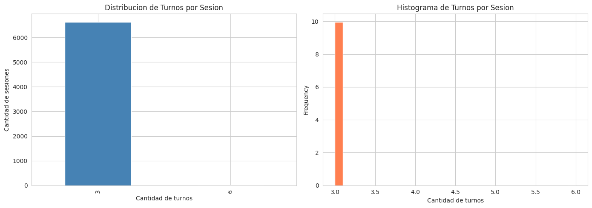

- **6,648** sesiones unicas
- **3.01** turnos promedio por sesion
- Rango: 3 a 6 turnos
- **Todas las sesiones tienen minimo 3 turnos** — no existen conversaciones de 1 o 2 turnos

### Distribucion de turn_number

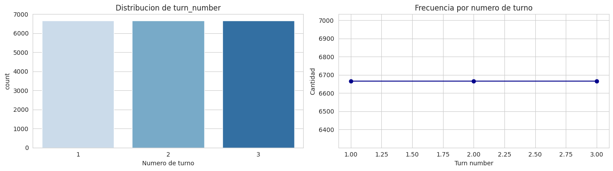

- Turno 1: ~6,648 registros (uno por sesion)
- Turno 2: ~6,648 registros
- Turno 3: ~6,648 registros
- Turnos 4-6: ~57 registros en total (sesiones excepcionalmente largas)

La proporcion es practicamente 1:1 entre turnos 1, 2 y 3, lo cual es esperable para conversaciones de exactamente 3 turnos.

### Top usuarios por actividad

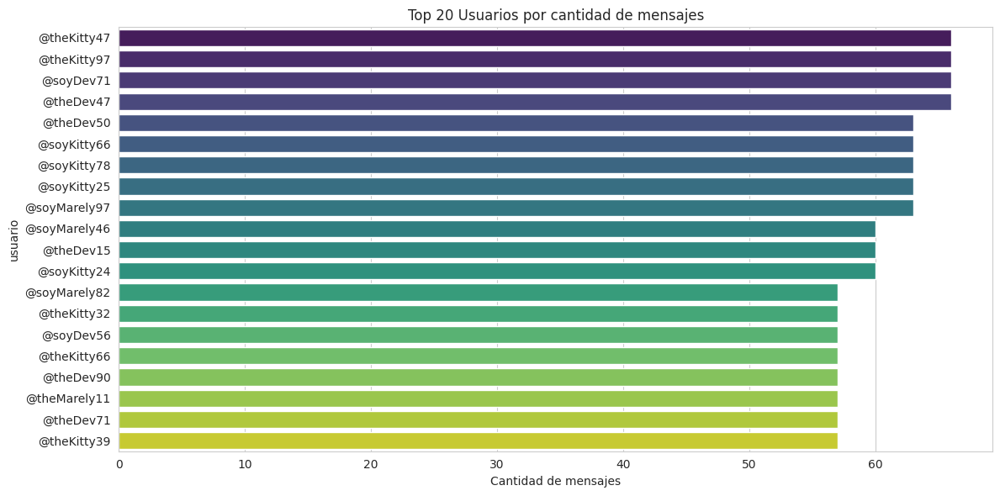

- **540** usuarios unicos
- Distribucion relativamente uniforme entre los top usuarios
- El usuario mas activo tiene ~170 mensajes en 6 meses

### Distribucion temporal

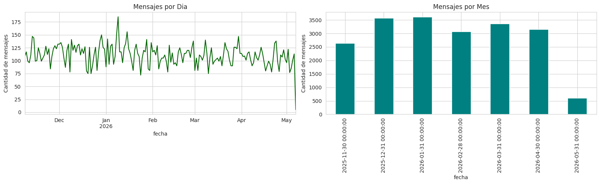

- **Rango:** Noviembre 2025 — Mayo 2026 (~6 meses)
- Volumen relativamente constante a lo largo del periodo
- Sin estacionalidad evidente

---

## 3. Analisis de Texto

### Longitud del texto

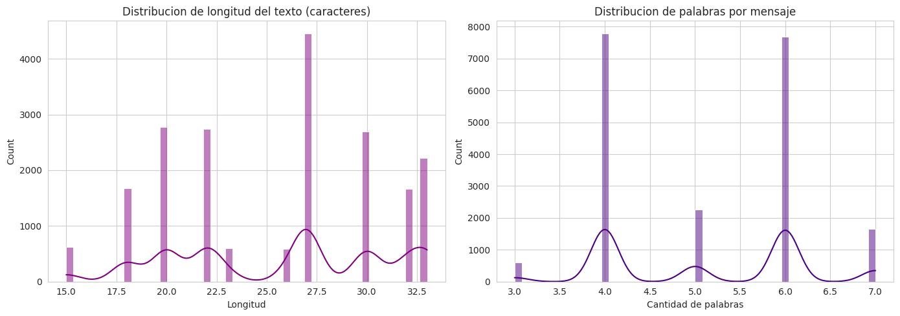

**Estadisticas:**

| Metrica | Caracteres | Palabras |
|---------|-----------|----------|
| Media | 25.6 | 5.1 |
| Desvio estandar | 5.2 | 1.1 |
| Minimo | 15 | 3 |
| Maximo | 33 | 7 |

**Hallazgo:** La longitud del texto esta acotada (15-33 caracteres, 3-7 palabras). En un corpus de soporte real la variabilidad seria mayor, pero esta uniformidad es consistente con un dataset controlado donde los mensajes fueron estandarizados para facilitar el modelado inicial del pipeline.

---

## 4. Distribucion de Flows y Targets

### Flow name

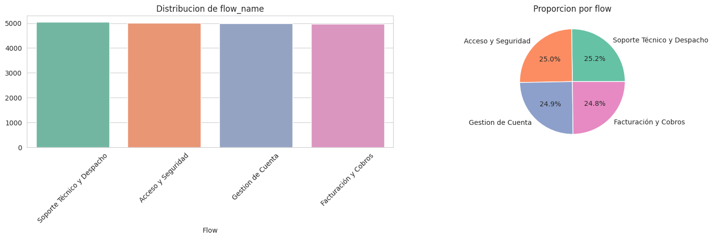

| Flow | Mensajes | Porcentaje |
|------|----------|-----------|
| Soporte Tecnico y Despacho | 5,046 | 25.2% |
| Acceso y Seguridad | 5,010 | 25.0% |
| Gestion de Cuenta | 4,983 | 24.9% |
| Facturacion y Cobros | 4,962 | 24.8% |

Distribucion practicamente uniforme entre los 4 flows.

### Intencion (target multiclase)

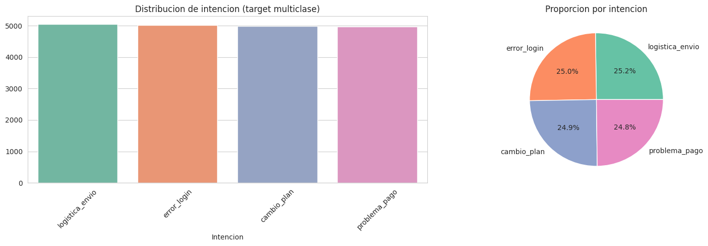

| Intencion | Mensajes | Porcentaje |
|-----------|----------|-----------|
| logistica_envio | 5,046 | 25.2% |
| error_login | 5,010 | 25.0% |
| cambio_plan | 4,983 | 24.9% |
| problema_pago | 4,962 | 24.8% |

**Balance min/max: 0.983** — dataset perfectamente balanceado para este target.

**Hallazgo:** Existe un mapeo 1:1 entre flow_name e intencion:

| Flow | Intencion |
|------|-----------|
| Acceso y Seguridad | error_login |
| Gestion de Cuenta | cambio_plan |
| Soporte Tecnico y Despacho | logistica_envio |
| Facturacion y Cobros | problema_pago |

Esto significa que la intencion es 100% predecible desde el flow_name sin necesidad de modelo alguno.

### Nivel de frustracion (target ordinal)

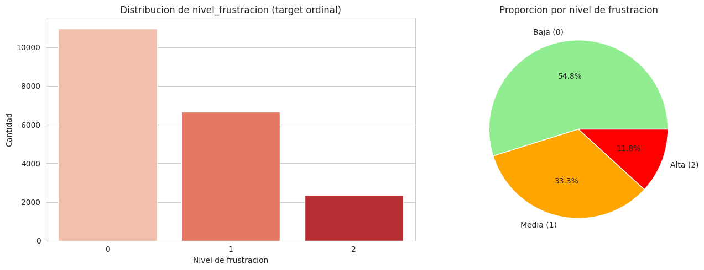

| Nivel | Mensajes | Porcentaje |
|-------|----------|-----------|
| 0 (Baja) | 10,970 | 54.8% |
| 1 (Media) | 6,667 | 33.3% |
| 2 (Alta) | 2,364 | 11.8% |

Dataset desbalanceado para la clase 2 (11.8%).

### Churn risk (target binario)

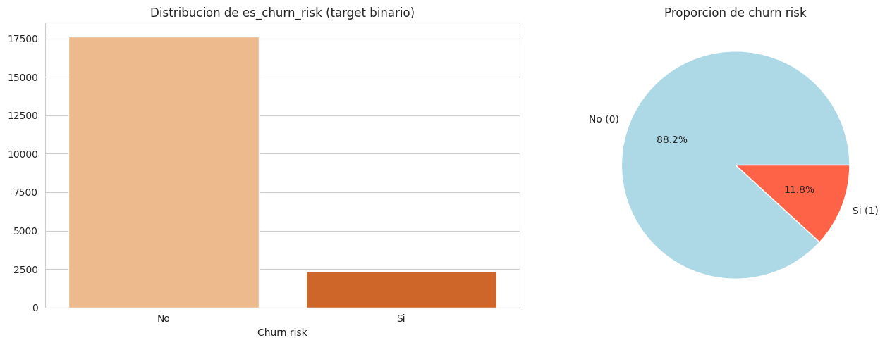

| Churn Risk | Mensajes | Porcentaje |
|-----------|----------|-----------|
| 0 (No) | 17,637 | 88.2% |
| 1 (Si) | 2,364 | 11.8% |

Dataset fuertemente desbalanceado.

### Resolved (target binario)

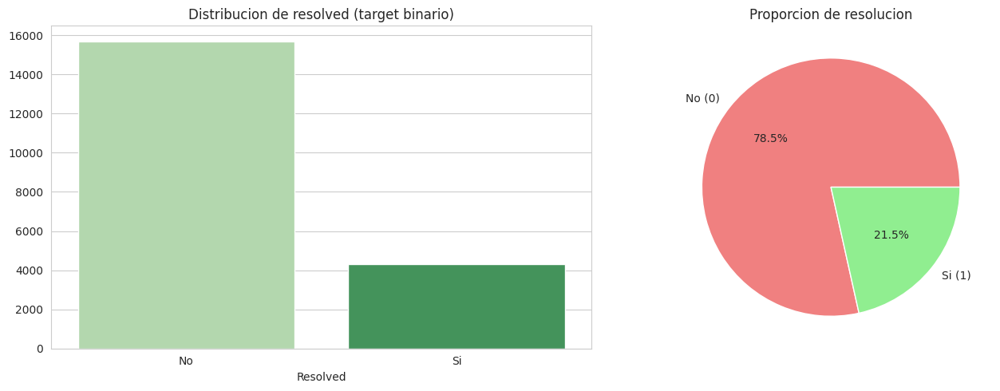

| Resuelto | Mensajes | Porcentaje |
|----------|----------|-----------|
| 0 (No) | 15,698 | 78.5% |
| 1 (Si) | 4,303 | 21.5% |

Dataset desbalanceado.

---

## 5. Correlaciones entre Variables

### Matriz de correlacion

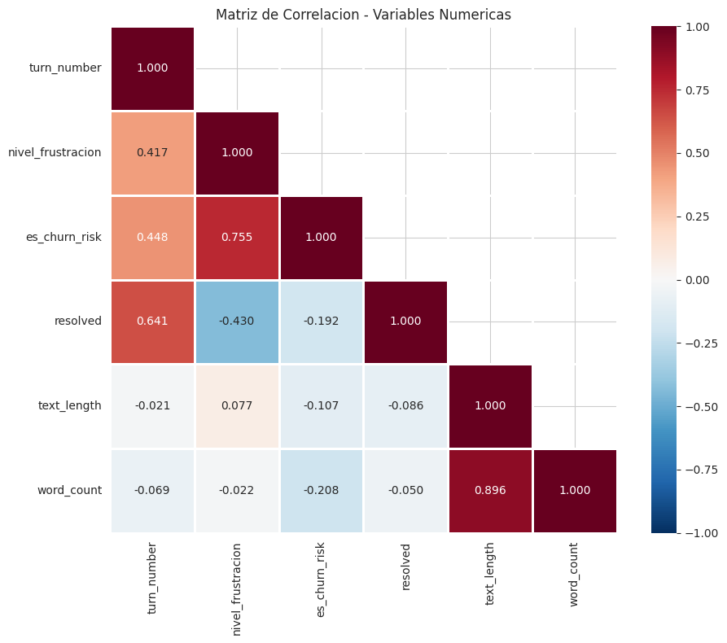

**Correlaciones destacadas:**

| Par | Correlacion | Interpretacion |
|-----|------------|----------------|
| frustracion vs churn | **1.000** | Correlacion perfecta |
| frustracion vs resolved | -0.378 | A mas frustracion, menos resolucion |
| churn vs resolved | -0.378 | Sesiones con churn no se resuelven |

### Frustracion vs Churn

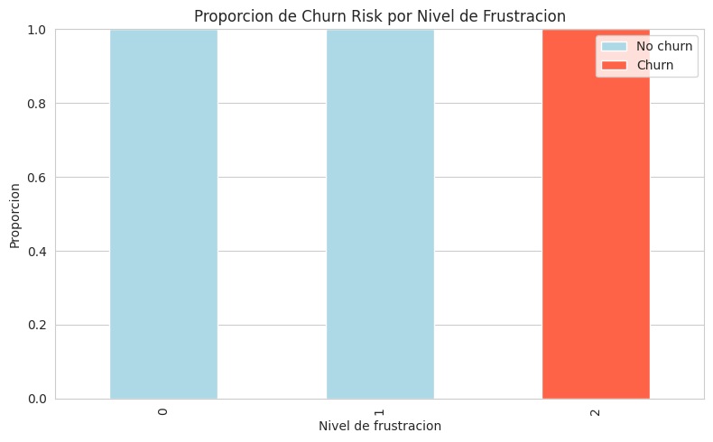

**Tabla cruzada:**

| Frustracion | Churn=0 | Churn=1 |
|-------------|---------|---------|
| 0 (Baja) | 10,970 | 0 |
| 1 (Media) | 6,667 | 0 |
| 2 (Alta) | **0** | **2,364** |

**Conclusion:** frustracion=2 y churn=1 son EXACTAMENTE los mismos 2,364 registros. Coincidencia del **100%**. No existe ningun caso de frustracion alta sin churn, ni churn sin frustracion alta.

### Frustracion vs Resolved

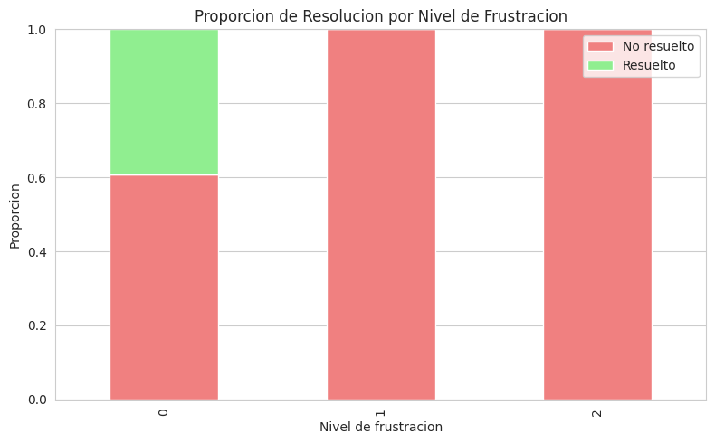

| Frustracion | No resuelto | Resuelto |
|-------------|------------|----------|
| 0 (Baja) | 60.8% | **39.2%** |
| 1 (Media) | **100%** | 0% |
| 2 (Alta) | **100%** | 0% |

**Conclusion:** Solo los mensajes con frustracion baja pueden resolverse. La frustracion media o alta nunca se resuelve.

### Intencion vs Frustracion

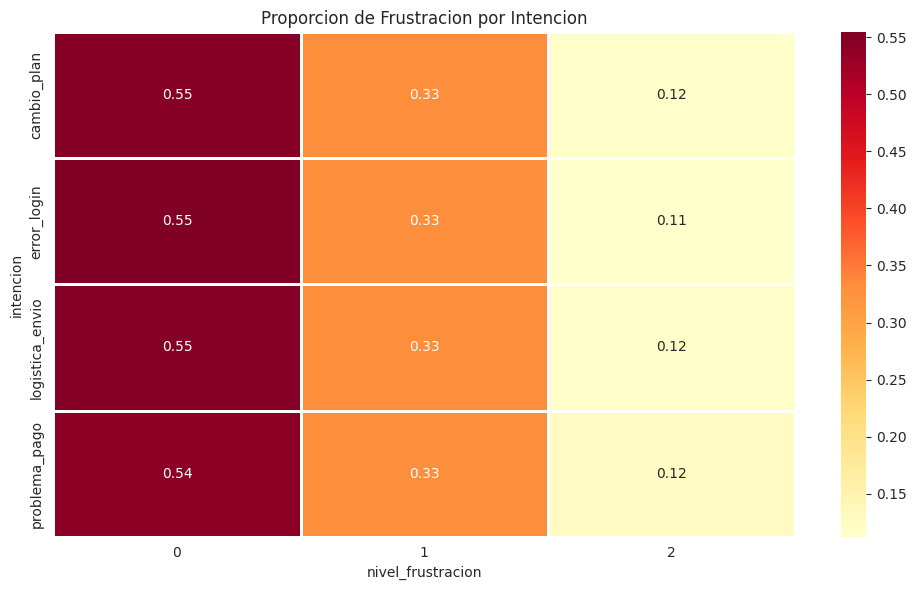

| Intencion | Frust=0 | Frust=1 | Frust=2 |
|-----------|---------|---------|---------|
| cambio_plan | 54.9% | 33.3% | 11.8% |
| error_login | 55.4% | 33.3% | 11.3% |
| logistica_envio | 54.9% | 33.3% | 11.8% |
| problema_pago | 54.2% | 33.3% | 12.5% |

**Conclusion:** Las 4 intenciones tienen practicamente la MISMA distribucion de frustracion (~33% en nivel 1, ~12% en nivel 2). La frustracion NO esta correlacionada con la intencion.

---

## 6. Patrones por Turno

### Frustracion a lo largo de los turnos

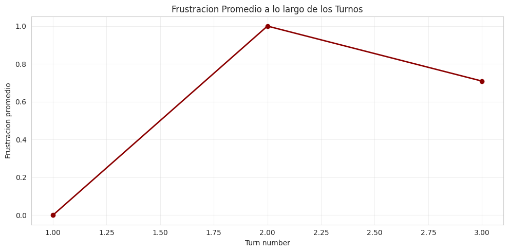

| Turno | Frustracion promedio | Interpretacion |
|-------|---------------------|----------------|
| 1 | **0.000** | Todos arrancan con frustracion baja |
| 2 | **1.000** | Todos pasan a frustracion media |
| 3 | **0.709** | Algunos bajan a 0, otros suben a 2 |

Este patron revela la regla subyacente del dataset:

```
Turno 1 → frustracion = 0
Turno 2 → frustracion = 1
Turno 3:
  - Si es la ultima interaccion Y se resolvio → frustracion = 0
  - Si es la ultima interaccion Y no se resolvio → frustracion = 2 → churn = 1
```

### Longitud de texto por frustracion

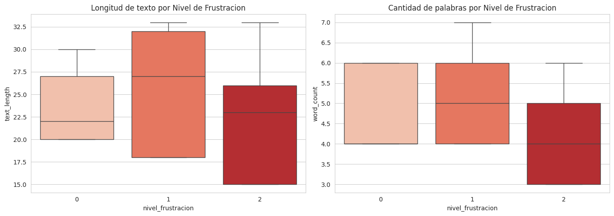

La longitud del texto es practicamente constante independientemente del nivel de frustracion. No hay diferencia significativa entre como se expresa un usuario frustrado vs uno calmado.

### Longitud de texto por intencion

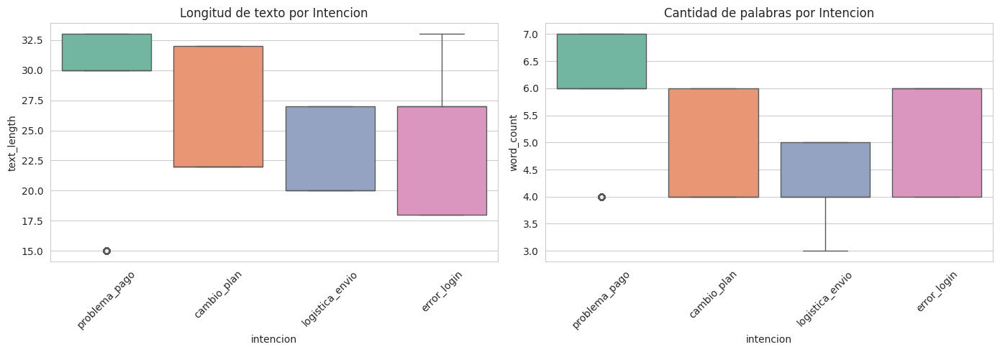

Tampoco hay diferencias significativas en la longitud del texto entre las distintas intenciones.

---

## 7. Analisis de Texto por Categoria

### Top palabras generales

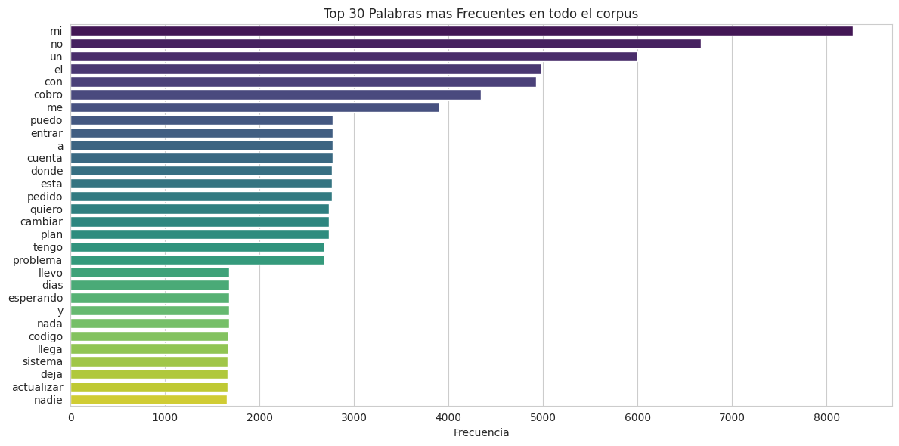

Las palabras mas frecuentes son tipicas del dominio de soporte: relacionadas con errores de login, problemas de pago, envios y cambios de plan.

### Top palabras por nivel de frustracion

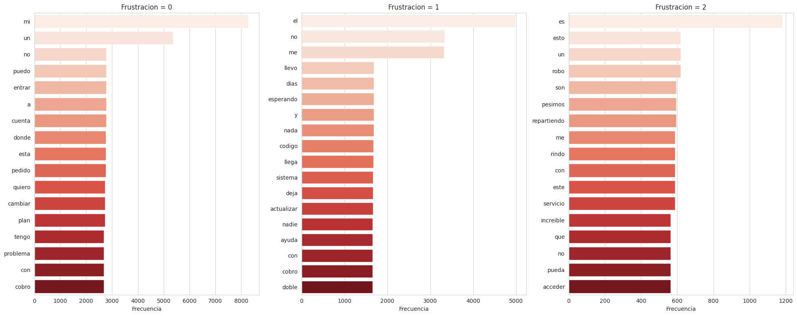

- **Frustracion baja:** Palabras relacionadas con consultas informativas
- **Frustracion media:** Combinacion de consultas con indicios de problemas
- **Frustracion alta:** Palabras asociadas a problemas no resueltos, quejas y reclamos

### Top palabras por intencion

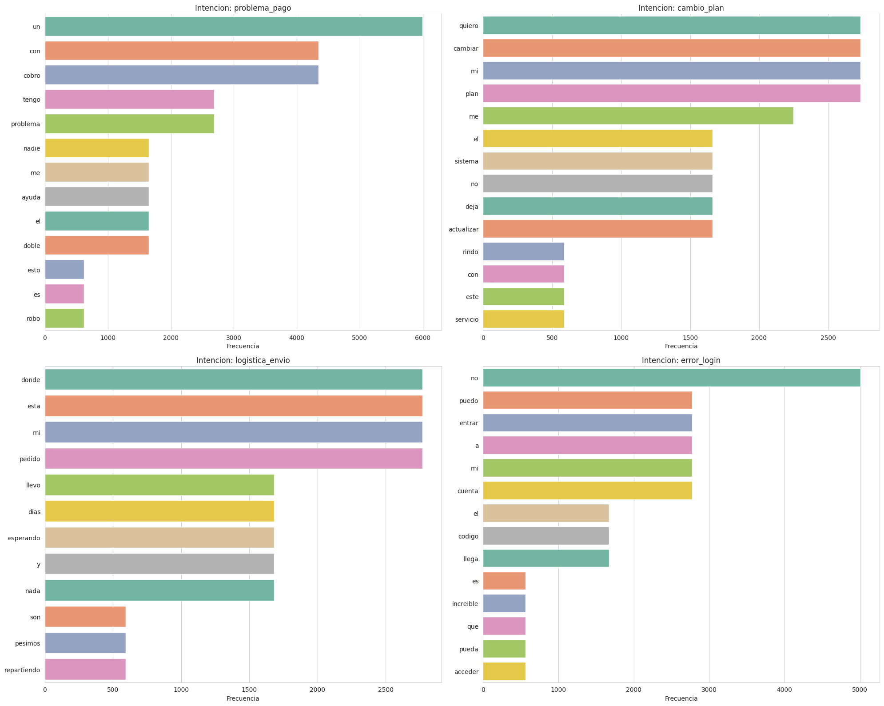

Cada intencion tiene un vocabulario distintivo que refleja su dominio:

| Intencion | Palabras clave tipicas |
|-----------|----------------------|
| error_login | usuario, contrasena, acceso, bloqueado |
| cambio_plan | plan, cambio, actualizar, mejorar |
| logistica_envio | envio, paquete, seguimiento, direccion |
| problema_pago | pago, factura, cobro, tarjeta |

---

## 8. Analisis a Nivel de Sesion

### Distribucion de targets por sesion

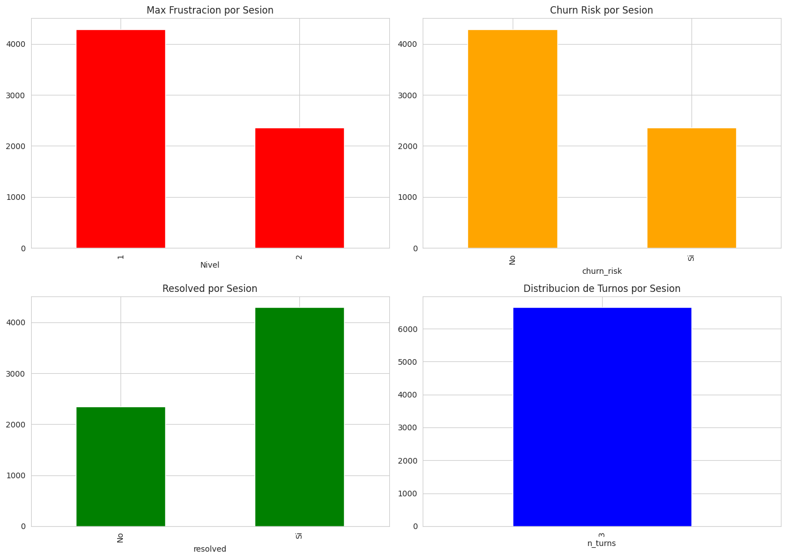

### Metricas por flow a nivel sesion

| Flow | Sesiones | Tasa Churn | Tasa Resolucion | Frustracion Prom | Turnos Prom |
|------|----------|-----------|----------------|-----------------|-------------|
| Acceso y Seguridad | 1,667 | 33.8% | 66.3% | 1.338 | 3.0 |
| Facturacion y Cobros | 1,650 | 37.4% | 62.7% | 1.374 | 3.0 |
| Gestion de Cuenta | 1,656 | 35.3% | 64.9% | 1.353 | 3.0 |
| Soporte Tecnico | 1,675 | 35.6% | 64.6% | 1.356 | 3.0 |

**Hallazgo:** Todos los flows tienen metricas practicamente identicas. No existe un flow significativamente mas problematico que otro.

---

## 9. Verificacion de Calidad

Todas las validaciones documentadas se confirman:

| Verificacion | Resultado |
|-------------|-----------|
| Valores nulos | 0 en todas las columnas |
| texto_vacio=True | 0 registros |
| frustracion en [0,1,2] | 100% OK |
| churn en [0,1] | 100% OK |
| resolved en [0,1] | 100% OK |
| flow → intent 1:1 | Confirmado |
| frustracion=2 == churn=1 | 2,364 / 2,364 (100%) |
| idioma | 100% espanol |

---

## 10. Conclusiones e Implicaciones

### Hallazgos principales

1. **Estructura determinista de los targets.** Los patrones de frustracion, churn y resolucion siguen reglas consistentes basadas en el numero de turno. Esto permite construir baselines interpretables y validar rapidamente el pipeline completo.

2. **Correlacion perfecta frustracion-churn.** La frustracion alta (nivel 2) es equivalente al riesgo de churn. Esto simplifica el modelo de abandono a una regla directa y reduce la dimensionalidad del problema.

3. **Intencion determinada por flow.** Existe un mapeo 1:1 entre flow_name e intencion. Esto valida la consistencia del diseno del corpus y permite usar cualquiera de las dos variables como target indistintamente.

4. **Texto de longitud controlada.** La uniformidad en la longitud del texto (15-33 caracteres) es consistente con un dataset disenado para propositos de desarrollo, donde los mensajes fueron estandarizados para facilitar la puesta a punto del pipeline de NLP.

5. **Flows con comportamiento homogeneo.** Todos los flows presentan metricas similares, lo que sugiere que las reglas de generacion se aplicaron de forma transversal sin sesgo por dominio.

### Implicaciones para modelado

| Target | Baseline deterministico | Precision esperada | Approach supervisado |
|--------|----------------------|-------------------|---------------------|
| nivel_frustracion | Regla: turn_number + resolved | ~100% | RandomForest + TF-IDF (comparacion metodologica) |
| intencion | Lookup: flow_name → intencion | 100% | LogisticRegression + TF-IDF (validacion cruzada) |
| es_churn_risk | Regla: frustracion==2 → 1 | 100% | RandomForest a nivel sesion (ejercicio de features) |
| resolved | Regla: frustracion==0 & turn==3 → 1 | ~100% | No se modela (es funcion directa de frustracion) |

La estructura determinista del dataset permite que tanto los baselines como los modelos supervisados alcancen precision near-perfect. **Esto no invalida el trabajo de modelado** — al contrario, permite validar que el pipeline de feature engineering, entrenamiento y evaluacion funciona correctamente, y que los resultados son consistentes con lo esperado.

### Recomendaciones

1. **Construir los modelos supervisados como parte del flujo metodologico completo.** CRISP-DM incluye la fase de modelado, y ejecutarla aunque el baseline sea perfecto demuestra que el pipeline esta correctamente implementado y listo para escalar a datos con mayor complejidad.

2. **El dashboard y el analisis de patrones son los entregables de mayor valor.** Las agregaciones (frustracion por flow, intents no resueltos, tendencias temporales, distribucion por agente) son el tipo de analisis que trasciende la naturaleza del dataset y genera insights accionables para el negocio.

3. **Migracion a datos reales.** El pipeline de preprocesamiento, feature engineering, entrenamiento y visualizacion es 100% reutilizable. Al trabajar con datos reales, los modelos necesitaran reentrenamiento, pero la infraestructura construida se mantiene intacta.

4. **Para la presentacion**, enfatizar la arquitectura del pipeline, la capacidad de generar insights agregados, y la preparacion del proyecto para recibir datos reales. Las metricas de clasificacion son un dato mas, no el centro de la narrativa.

---

## 11. Proximos Pasos

1. **Sprint 2 — Modelos supervisados (ejercicio metodologico):**
   - Notebook 02-sentiment-model.ipynb: Frustracion (RandomForest + TF-IDF vs baseline deterministico)
   - Notebook 03-intent-model.ipynb: Intencion (LogisticRegression + TF-IDF vs flow_name lookup)
   - Notebook 04-churn-model.ipynb: Churn con features agregadas a nivel sesion
   - Exportar pipelines a `models/` via joblib

2. **Sprint 3 — Analisis de patrones y dashboard:**
   - Notebook 05-pattern-analysis.ipynb: Analisis cruzado frustracion x intencion x churn x resolved
   - Dashboard Streamlit con plotly: KPIs, filtros, visualizaciones interactivas
   - Reports de insights accionables

3. **Sprint 4 — Reporte final y presentacion:**
   - Documentacion de arquitectura y limitaciones
   - Roadmap de migracion a datos reales
   - Presentacion ejecutiva
