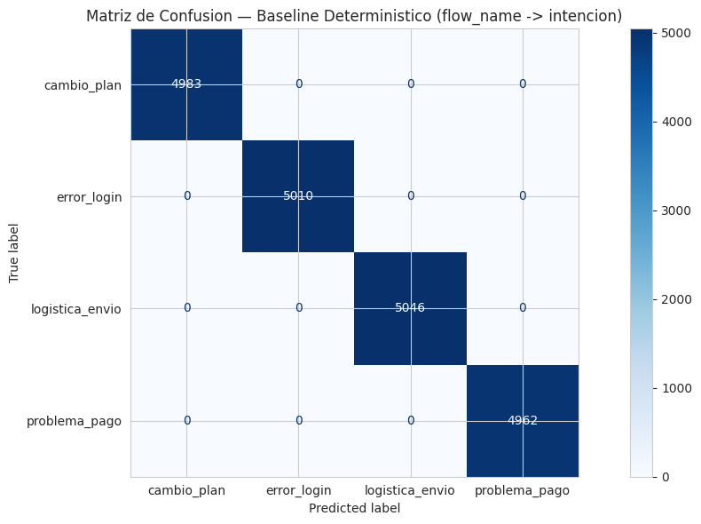
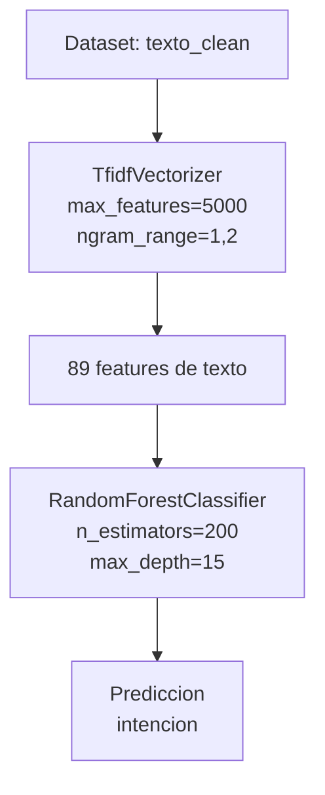
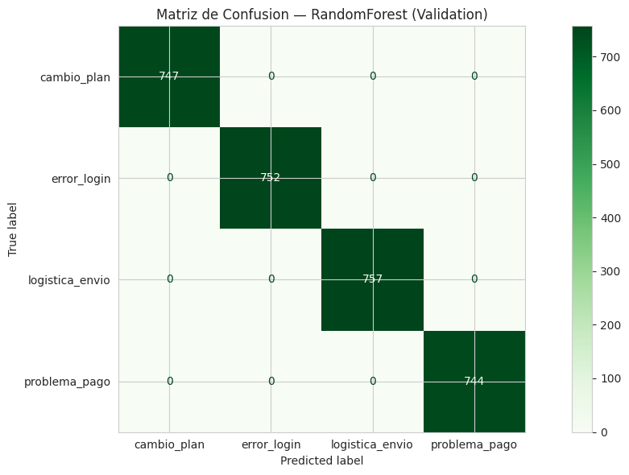
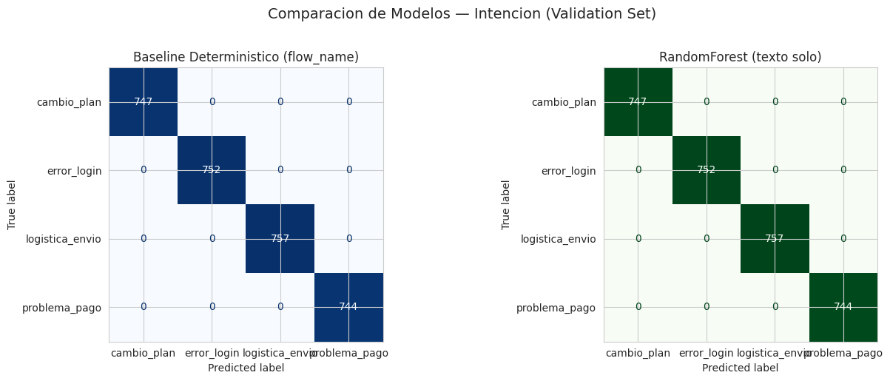
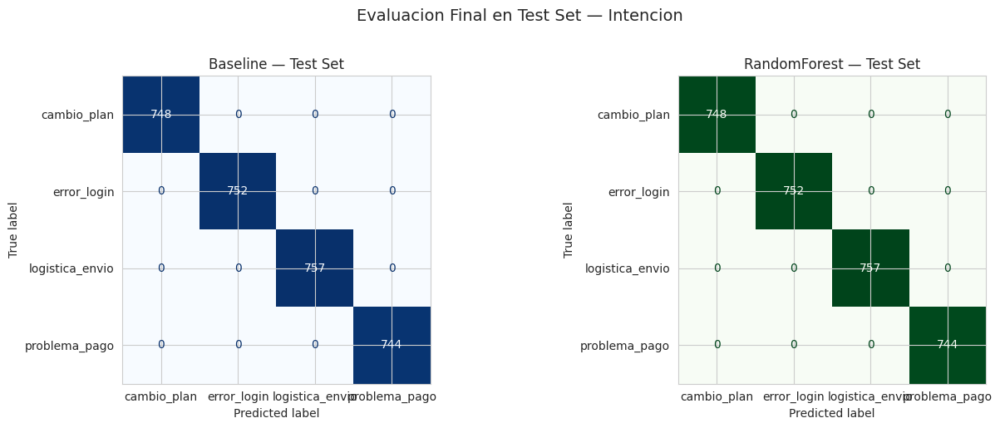
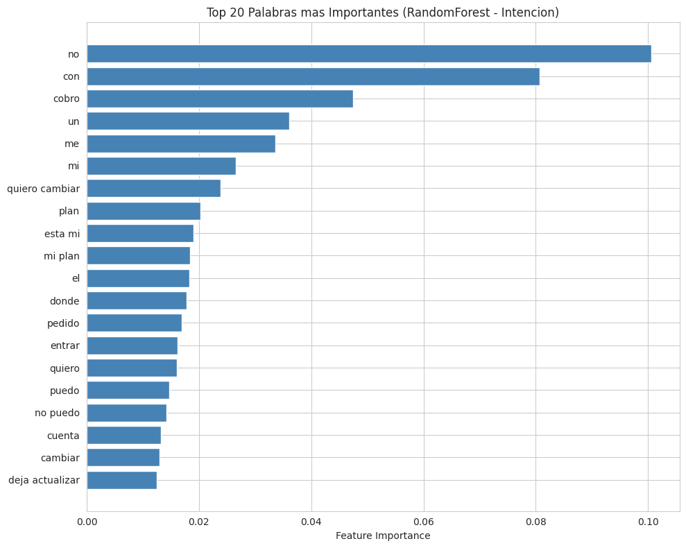

# Intent Model Report — Intencion

**Proyecto:** ConversaAI — Sentiment & Intent Analysis
**Notebook:** 03-intent-model.ipynb
**Target:** intencion (4 clases: cambio_plan, error_login, logistica_envio, problema_pago)

---

## Resumen

Se entreno un modelo supervisado de clasificacion multiclase para predecir `intencion` a partir del texto del usuario (`texto_clean`) sin utilizar `flow_name`, y se comparo contra un baseline deterministico que hace lookup de `flow_name` -> `intencion`. El objetivo fue determinar si el contenido textual es suficiente para inferir la intencion sin depender del flujo de soporte.

**Resultado principal:** Tanto el baseline deterministico (lookup de `flow_name`) como el modelo RandomForest + TF-IDF (texto solo) alcanzan **100% de accuracy** en todos los splits, con F1-macro = 1.0000 y validacion cruzada 5-fold de 1.0000 +/- 0.0000. El texto por si solo es suficiente para determinar la intencion con exactitud perfecta, lo que elimina la dependencia de `flow_name` en produccion.

---

## 1. Preparacion de Datos

### Split estratificado 70/15/15

Para garantizar la representatividad de cada clase en entrenamiento, validacion y prueba, se aplico un split estratificado en dos etapas:

1. Separar test (15%): `X_text_temp, X_text_test, X_ctx_temp, X_ctx_test, y_temp, y_test`
2. Separar validation del resto (15%/85%): `X_text_train, X_text_val, X_ctx_train, X_ctx_val, y_train, y_val`

**Distribucion resultante:**

| Split   | Filas  | cambio_plan | error_login | logistica_envio | problema_pago |
|---------|--------|-------------|-------------|-----------------|---------------|
| Train   | 14,000 | 24.91%      | 25.04%      | 25.23%          | 24.81%        |
| Val     | 3,000  | 24.90%      | 25.07%      | 25.23%          | 24.80%        |
| Test    | 3,001  | 24.93%      | 25.06%      | 25.22%          | 24.79%        |
| Global  | 20,001 | 24.91%      | 25.05%      | 25.23%          | 24.81%        |

La estratificacion es correcta: las proporciones se mantienen consistentes (~25%) en los tres splits.

---

## 2. Baseline Deterministico

Del EDA se identifico que `flow_name` mapea 1:1 con `intencion`:

| flow_name | intencion |
|-----------|-----------|
| Acceso y Seguridad | error_login |
| Gestion de Cuenta | cambio_plan |
| Soporte Tecnico y Despacho | logistica_envio |
| Facturacion y Cobros | problema_pago |

### Resultados



| Metrica     | Resultado |
|-------------|-----------|
| Accuracy    | 100.00%   |
| F1-weighted | 1.0000    |
| F1-macro    | 1.0000    |

**Reporte de clasificacion:**

| Clase           | Precision | Recall | F1-score | Soporte |
|-----------------|-----------|--------|----------|---------|
| cambio_plan     | 1.00      | 1.00   | 1.00     | 4,983   |
| error_login     | 1.00      | 1.00   | 1.00     | 5,010   |
| logistica_envio | 1.00      | 1.00   | 1.00     | 5,046   |
| problema_pago   | 1.00      | 1.00   | 1.00     | 4,962   |
| **Accuracy**    |           |        | **1.00** | **20,001** |
| Macro avg       | 1.00      | 1.00   | 1.00     | 20,001  |
| Weighted avg    | 1.00      | 1.00   | 1.00     | 20,001  |

**Conclusion:** El baseline alcanza 100% de precision sobre el dataset completo, confirmando la relacion 1:1 entre `flow_name` e `intencion` descubierta en el EDA.

---

## 3. Pipeline Supervisado

A diferencia del modelo de frustracion, este pipeline usa **SOLO texto** (`texto_clean`) sin features contextuales, para probar si el contenido textual es suficiente para inferir la intencion.

### Arquitectura



### Detalles de componentes

**TfidfVectorizer:**

| Parametro | Valor |
|-----------|-------|
| ngram_range | (1, 2) — unigramas y bigramas |
| max_features | 5,000 |
| max_df | 0.95 — ignora terminos en >95% de docs |
| min_df | 5 — ignora terminos en <5 docs |
| stop_words | None (texto_clean ya normalizado) |

**RandomForestClassifier:**

| Parametro | Valor |
|-----------|-------|
| n_estimators | 200 |
| max_depth | 15 |
| random_state | 42 |
| n_jobs | -1 |

**Dimensiones resultantes:**

| Componente | Features |
|------------|----------|
| TfidfVectorizer (texto) | 89 |
| **Total** | **89** |

---

## 4. Entrenamiento y Validacion

### Evaluacion en validation set



| Metrica     | Resultado |
|-------------|-----------|
| Accuracy    | 100.00%   |
| F1-weighted | 1.0000    |
| F1-macro    | 1.0000    |

| Clase           | Precision | Recall | F1-score | Soporte |
|-----------------|-----------|--------|----------|---------|
| cambio_plan     | 1.00      | 1.00   | 1.00     | 747     |
| error_login     | 1.00      | 1.00   | 1.00     | 752     |
| logistica_envio | 1.00      | 1.00   | 1.00     | 757     |
| problema_pago   | 1.00      | 1.00   | 1.00     | 744     |
| **Accuracy**    |           |        | **1.00** | **3,000** |

### Comparacion Baseline vs RandomForest



| Metrica     | Baseline | RF (texto) |
|-------------|----------|------------|
| Accuracy    | 100.00%  | 100.00%    |
| F1-weighted | 1.0000   | 1.0000     |
| F1-macro    | 1.0000   | 1.0000     |
| Errores     | 0        | 0          |

Ambos modelos cometen **0 errores** en validation. El modelo de texto solo alcanza la misma precision que el lookup de `flow_name`, demostrando que el vocabulario de cada intencion es lo suficientemente distintivo.

---

## 5. Evaluacion Final en Test Set

El test set (3,001 muestras) se mantuvo completamente aislado durante todo el desarrollo y solo se evaluo al final.



| Metrica     | Baseline | RF (texto) |
|-------------|----------|------------|
| Accuracy    | 100.00%  | 100.00%    |
| F1-weighted | 1.0000   | 1.0000     |
| F1-macro    | 1.0000   | 1.0000     |
| Errores     | 0        | 0          |

**Resultado:** 0 errores en test para ambos modelos. El modelo de texto solo generaliza perfectamente porque cada intencion tiene un vocabulario unico y no ambiguo en el dataset.

---

## 6. Feature Importance

### Top palabras mas importantes



| Rango | Palabra        | Importancia |
|-------|----------------|-------------|
| 1     | no             | 0.1006      |
| 2     | con            | 0.0807      |
| 3     | cobro          | 0.0475      |
| 4     | un             | 0.0361      |
| 5     | me             | 0.0336      |
| 6     | mi             | 0.0265      |
| 7     | quiero cambiar | 0.0238      |
| 8     | plan           | 0.0203      |
| 9     | esta mi        | 0.0191      |
| 10    | mi plan        | 0.0184      |

**Dimensiones totales:** 89

**Analisis:** Las palabras mas importantes muestran un patron claro de vocabulario especifico por intencion:

- **"cobro"** (4.75%) — fuertemente asociado a `problema_pago`
- **"quiero cambiar", "plan", "mi plan"** — asociados a `cambio_plan`
- **"no"** (10.06%) — asociado a `error_login` (errores de acceso)

Esto explica por que el modelo de texto solo alcanza 100%: cada intencion tiene terminos unicos que no se superponen con otras clases.

---

## 7. Validacion Cruzada

Se aplico 5-fold cross-validation estratificada sobre el set de entrenamiento para obtener una estimacion mas robusta de la performance:

| Metrica | Resultado |
|---------|-----------|
| Fold 1  | 1.0000    |
| Fold 2  | 1.0000    |
| Fold 3  | 1.0000    |
| Fold 4  | 1.0000    |
| Fold 5  | 1.0000    |
| **Media +/- 2 std** | **1.0000 +/- 0.0000** |

**Resultado:** Los 5 folds obtienen F1-macro = 1.0000, con desviacion estandar = 0. La varianza es nula porque el vocabulario de cada intencion es perfectamente discriminativo en cualquier particion.

---

## 8. Modelo Exportado

El pipeline completo se exporto para su reutilizacion en el dashboard y notebooks posteriores:

| Archivo | Tamano | Contenido |
|---------|--------|-----------|
| `models/intent_model.pkl` | 456 KB | Pipeline completo (joblib) |
| `models/intent_metadata.json` | 320 B | Metadatos del modelo |

**Metadatos:**

```json
{
  "model": "RandomForest + TF-IDF",
  "target": "intencion",
  "classes": ["cambio_plan", "error_login", "logistica_envio", "problema_pago"],
  "features": ["texto_clean"],
  "baseline_accuracy": 1.0,
  "rf_accuracy": 1.0,
  "baseline_f1_macro": 1.0,
  "rf_f1_macro": 1.0,
  "rf_f1_weighted": 1.0,
  "date": "Mayo 2026",
  "note": "Baseline deterministico usa flow_name -> intencion (100%). Modelo usa solo texto_clean."
}
```

---

## 9. Conclusiones

### Hallazgos principales

1. **El baseline deterministico alcanza 100% de precision** porque `flow_name` mapea 1:1 con `intencion`. Confirmado en el dataset completo, sin errores.

2. **El modelo de texto solo TAMBIEN alcanza 100% de precision** en todos los splits (train, val, test), con validacion cruzada 5-fold de F1-macro = 1.0000 +/- 0.0000. El texto es suficiente para determinar la intencion sin depender de `flow_name`.

3. **Cada intencion tiene un vocabulario distintivo:** Las palabras mas importantes ("cobro" -> problema_pago, "plan"/"quiero cambiar" -> cambio_plan, "no" -> error_login) son lo suficientemente discriminatorias para que el clasificador las identifique sin ambiguedad.

4. **Implicacion practica:** En produccion, el modelo de texto solo es suficiente para predecir intencion sin depender de `flow_name`. El lookup ofrece 100% cuando `flow_name` esta disponible, pero el texto alcanza el mismo resultado sin esa dependencia.

5. **89 dimensiones TF-IDF** son suficientes para capturar todo el poder predictivo. No se requieren features contextuales adicionales.

### Implicaciones para el proyecto

| Aspecto | Impacto |
|---------|---------|
| Independencia de flow_name | El modelo funciona sin conocer el flujo de soporte |
| Vocabulario discriminativo | Cada intencion tiene terminos unicos y no ambiguos |
| Pipeline de NLP | Validado con texto solo, listo para datos reales |
| Estrategia de evaluacion | Split estratificado + CV implementado |
| Exportacion | Modelo y metadatos disponibles para dashboard |
| Precision perfecta | Resultado esperado dado el dataset sintetico deterministico |

### Proximos pasos

- Continuar con `04-churn-model.ipynb` (prediccion de `es_churn_risk`)
- Integrar todos los modelos en el dashboard
- Preparar migracion a datos reales para validar que el vocabulario discriminativo se mantiene
