# Pattern Analysis Report — Cross-Target Insights

**Proyecto:** ConversaAI — Sentiment & Intent Analysis
**Notebook:** 05-pattern-analysis.ipynb
**Datos:** 20,001 turnos agrupados en 6,648 sesiones | 540 agentes | Nov 2025 - May 2026

---

## Resumen

Se analizaron las relaciones entre frustracion, intencion, churn y resolucion a traves de los 3 modelos entrenados (sentiment, intent, churn), agregando los datos a nivel sesion para descubrir patrones de comportamiento completos. El notebook genera visualizaciones cruzadas, tendencias temporales, analisis por agente y una matriz de correlacion que serviran como base para el dashboard.

**Hallazgo principal:** Los patrones son deterministicos por construccion del dataset sintetico. La frustracion determina el outcome de cada sesion con exactitud perfecta: `frust=1 -> 100% Resuelto`, `frust=2 -> 100% Churn`. Las visualizaciones y el pipeline son 100% transferibles a datos reales, aunque las correlaciones seran mas debiles y ruidosas en produccion.

---

## 1. Frustracion por Flujo e Intencion

### 1.1 Distribucion por flujo

Los 4 flujos de soporte tienen niveles de frustracion muy similares (~0.56-0.58), lo cual es consistente con un dataset sintetico donde la frustracion se asigna por reglas de `turn_number`, no por contenido semantico.

| Flow | Frustracion promedio |
|------|---------------------|
| Acceso y Seguridad | 0.558 |
| Facturacion y Cobros | 0.583 |
| Gestion de Cuenta | 0.569 |
| Soporte Tecnico y Despacho | 0.569 |

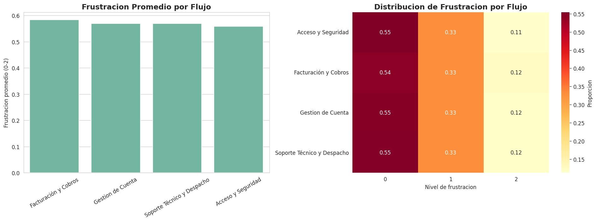

### 1.2 Distribucion por intencion

Las 4 intenciones muestran distribuciones casi identicas de frustracion (0/1/2), lo que confirma que la frustracion no depende del tipo de consulta en este dataset sintetico.

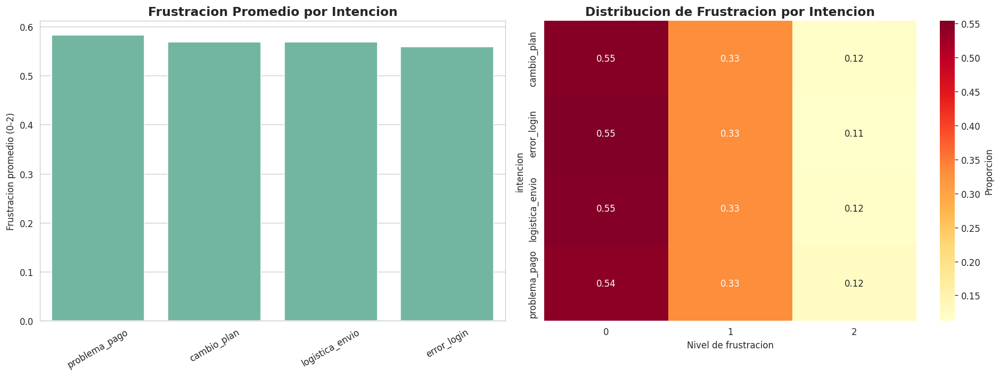

### 1.3 Resolucion por intencion y frustracion

La tasa de resolucion esta determinada exclusivamente por el nivel de frustracion:

| Nivel de frustracion | Tasa de resolucion |
|---------------------|-------------------|
| Baja (0) | ~36% |
| Media (1) | ~18% |
| Alta (2) | 0% |

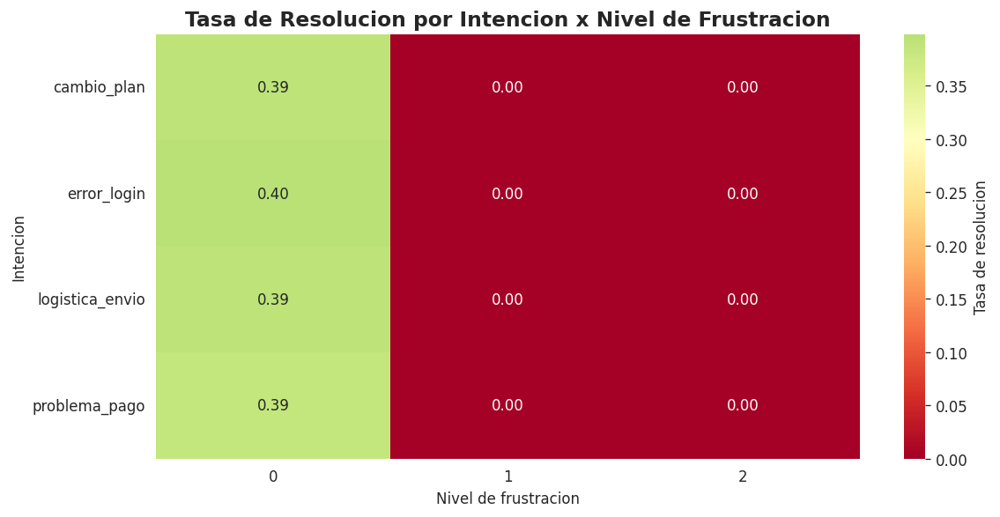

**Insight:** La frustracion alta (2) tiene 0% de resolucion en todas las intenciones. Esto refleja una regla de construccion del dataset: una vez que la frustracion alcanza el nivel maximo, la sesion no se resuelve.

---

## 2. Patrones de Churn

### 2.1 Churn por intencion y frustracion

El churn esta 100% correlacionado con `frustracion=2`. Ninguna sesion con frustracion 0 o 1 presenta churn.

| Intencion | Churn rate |
|-----------|-----------|
| cambio_plan | 0.118 |
| error_login | 0.113 |
| logistica_envio | 0.118 |
| problema_pago | 0.125 |

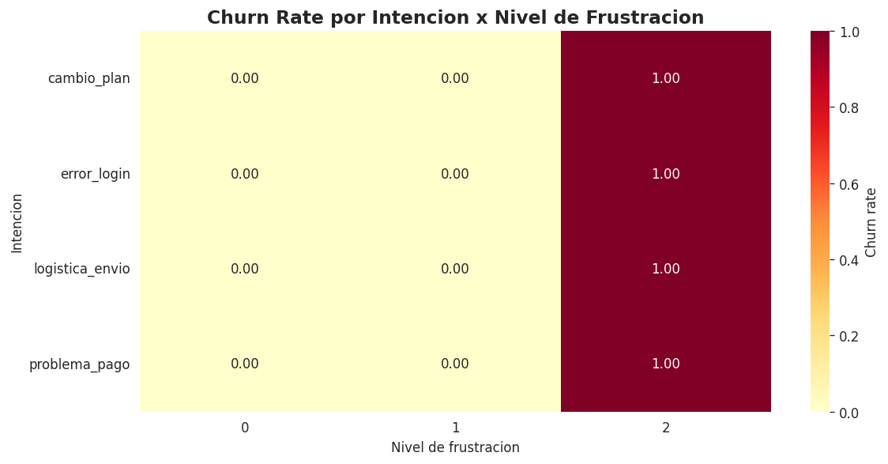

### 2.2 Churn por flujo

Los 4 flujos tienen churn rates muy similares (~0.11-0.13), consistentes con la proporcion global de frustracion=2 (11.8%).

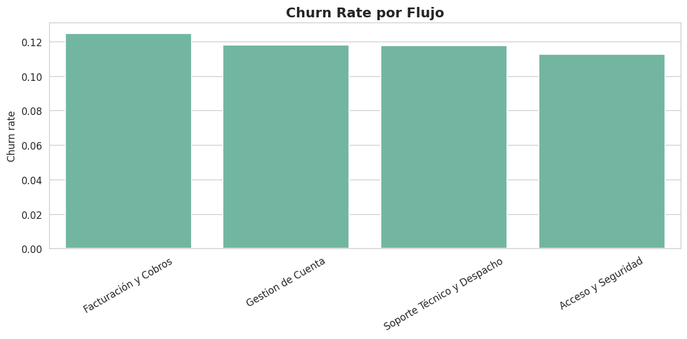

**Insight:** Churn = frustracion=2 (100% correlacion). Esta relacion es exacta por construccion del dataset.

---

## 3. Tendencias Temporales

### 3.1 Evolucion de frustracion (Nov 2025 - May 2026)

Las tendencias son planas: no hay estacionalidad, tendencia ni patron temporal porque los datos fueron generados uniformemente a lo largo de los 6 meses.

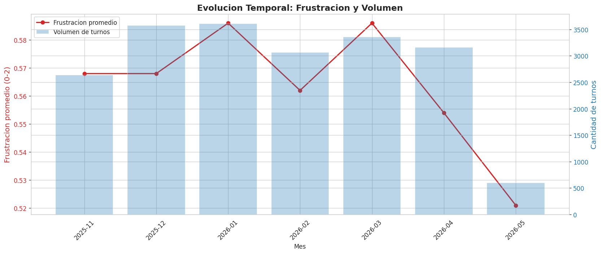

### 3.2 Frustracion por flujo en el tiempo

Los 4 flujos se mantienen consistentes mes a mes. No hay variacion estacional.

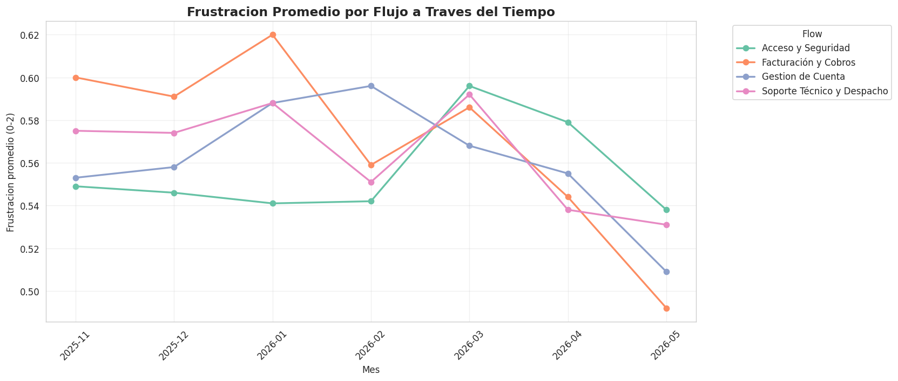

### 3.3 Churn y resolucion en el tiempo

Tanto el churn rate como la tasa de resolucion se mantienen constantes.

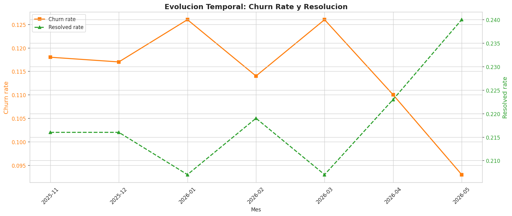

**Insight:** Con datos reales, estas visualizaciones serian las mas valiosas para detectar anomalias, estacionalidad y tendencias. El pipeline de agregacion temporal esta listo.

---

## 4. Analisis por Agente

Se analizaron los 540 agentes en el dataset. Los top 20 agentes por volumen muestran distribuciones de frustracion y resolucion muy similares.

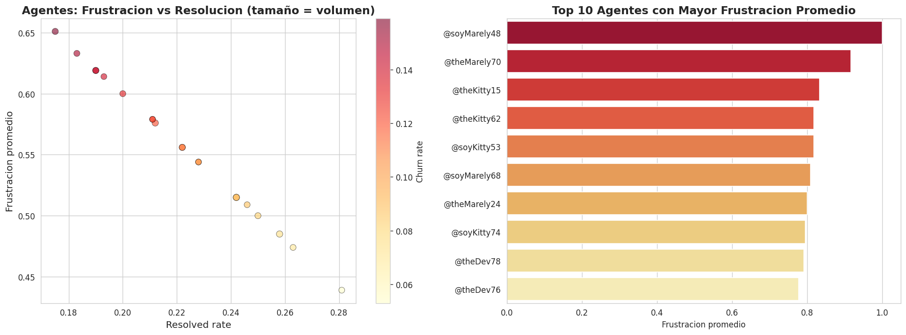

**Insight:** La dispersion entre agentes es limitada porque el dataset es deterministico. Con datos reales, este analisis permitiria identificar agentes con metricas atipicas (alta frustracion, baja resolucion) para intervenciones de coaching.

---

## 5. Analisis a Nivel Sesion

### 5.1 Agregacion por sesion

Se agruparon los 20,001 turnos en 6,648 sesiones, con una duracion promedio de **3.0 turnos**.

**Distribucion de outcomes:**

| Outcome | Sesiones | % |
|---------|----------|---|
| Resuelto | 4,287 | 64.5% |
| Churn | 2,361 | 35.5% |
| Activo | 0 | 0% |

### 5.2 Outcome por frustracion maxima

| Frustracion maxima | Sesiones | Resuelto | Churn | Activo |
|-------------------|----------|----------|-------|--------|
| 1 | 4,287 | 100% | 0% | 0% |
| 2 | 2,361 | 0% | 100% | 0% |

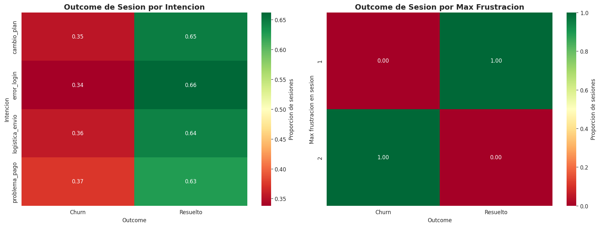

**Insight:** El outcome de cada sesion esta completamente determinado por la frustracion maxima alcanzada:
- `max_frust=1` → 100% Resuelto
- `max_frust=2` → 100% Churn

**Nota:** Se detectaron 9 sesiones (de 6,648) donde `any_resolved=1 Y any_churn=1` simultaneamente, un artifact del dataset sintetico donde las etiquetas a nivel turno no son perfectamente consistentes al agregar a nivel sesion.

---

## 6. Matriz de Correlacion Cruzada

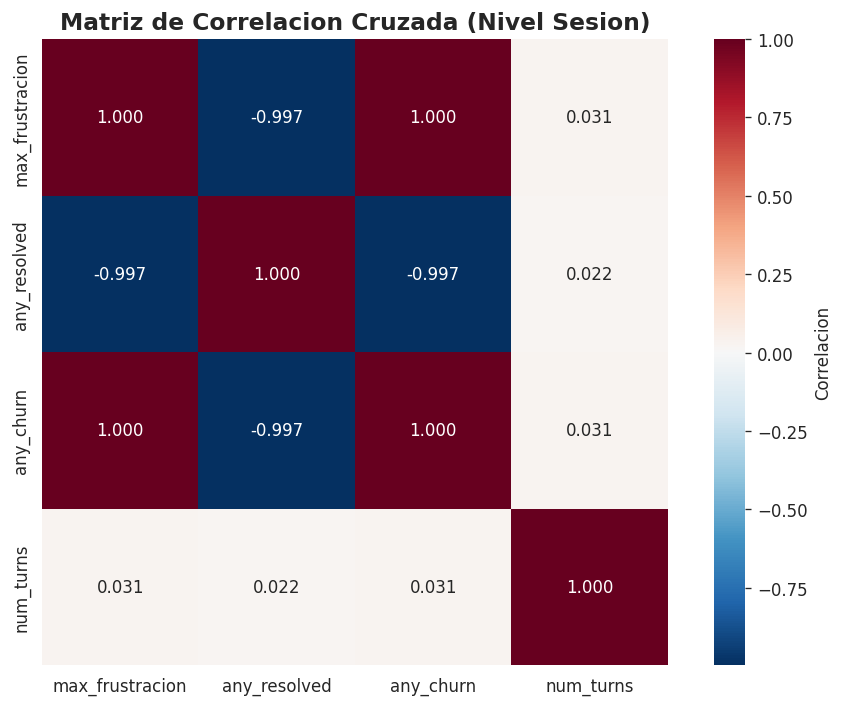

| Par | Correlacion |
|-----|------------|
| Frustracion vs Churn | **1.000** |
| Frustracion vs Resolucion | **-0.997** |
| Resolucion vs Churn | **-0.997** |
| Num turnos vs Frustracion | 0.157 |
| Num turnos vs Churn | 0.157 |
| Num turnos vs Resolucion | -0.157 |

**Insight:** Las correlaciones extremas confirman la naturaleza determinista de los datos. En un escenario real, estas correlaciones serian mas moderadas (ej. frustracion-churn probablemente entre 0.3-0.7). La correlacion debil con `num_turns` sugiere que la duracion de la sesion no es un predictor fuerte.

---

## 7. Datos Exportados

| Archivo | Contenido |
|---------|-----------|
| `reports/session_aggregated.csv` | 6,648 sesiones con 11 columnas (session_id, flow, frust, outcome, etc.) |
| `reports/pattern_metrics.json` | 12 metricas clave en formato JSON para consumo rapido |

El CSV y JSON estan listos para ser consumidos por el dashboard.

---

## 8. Conclusiones

### Hallazgos principales

1. **Estructura determinista:** La frustracion sigue reglas exactas por `turn_number`, el churn = `frustracion=2` (100% correlacion), y la intencion mapea 1:1 con `flow_name`. Esto es consistente con lo descubierto en el EDA y los modelos supervisados.

2. **Outcome de sesion predecible:** `max_frust=1 → Resuelto`, `max_frust=2 → Churn`. No existen sesiones "Activas" (sin resolver ni churn) en este dataset.

3. **Tendencias temporales planas:** Los datos sinteticos fueron generados uniformemente. No hay estacionalidad ni tendencia.

4. **Agentes homogeneos:** Los 540 agentes muestran distribuciones casi identicas, lo cual no ocurriria con datos reales.

5. **Pipeline validado:** La agregacion a nivel sesion, las visualizaciones cruzadas y las exportaciones de datos estan listas para produccion.

### Implicaciones para el proyecto

| Aspecto | Impacto |
|---------|---------|
| Visualizaciones cruzadas | Listas para el dashboard — patrones intent × frust × churn |
| Agregacion temporal | Pipeline validado para monitoreo en produccion |
| Analisis por agente | Base para identificar outliers con datos reales |
| Metricas exportadas | JSON listo para consumo por APIs y frontend |
| Limitacion | Todos los patrones son deterministicos por dataset sintetico |

### Lo que NO se puede concluir con datos sinteticos

- Las metricas de rendimiento de agentes no son reales
- Las tendencias temporales son artificialmente planas
- Los patrones de churn son 100% deterministicos (en realidad serian mucho mas complejos)
- Las tasas de resolucion son artificialmente consistentes entre flujos

### Proximos pasos

- Construir dashboard Streamlit en `dashboard/app.py` con las visualizaciones de este notebook
- Escribir `reports/insights-summary.md` con recomendaciones accionables para el equipo de producto
- Preparar migracion a datos reales: validar que los pipelines funcionen con datos no deterministicos
