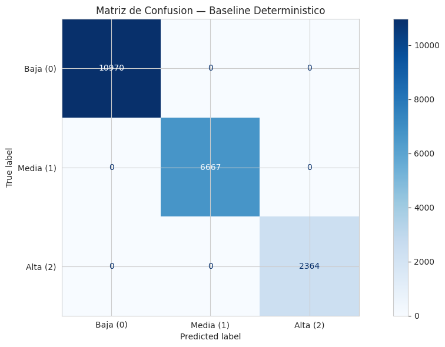
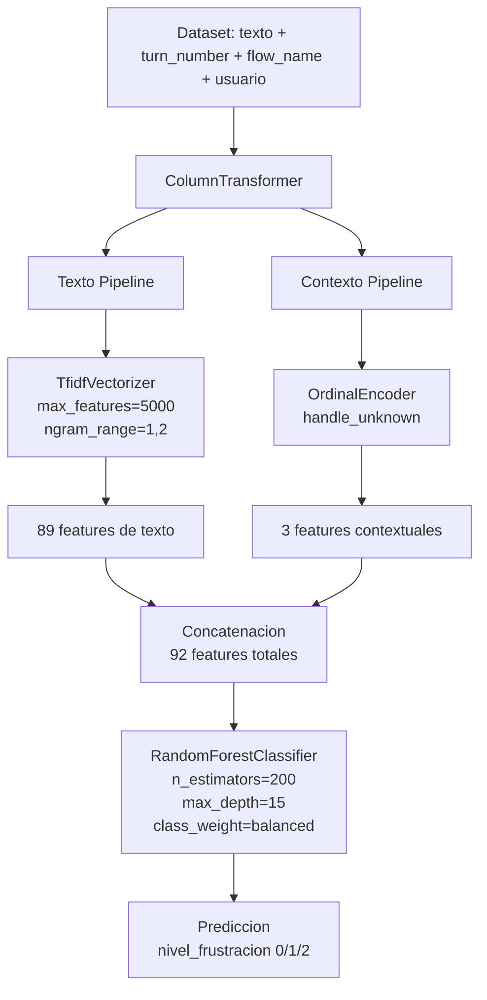
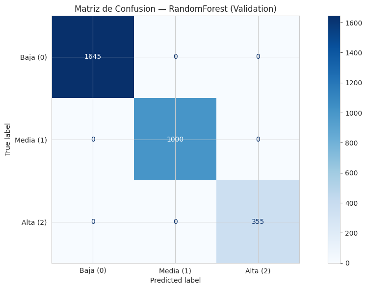
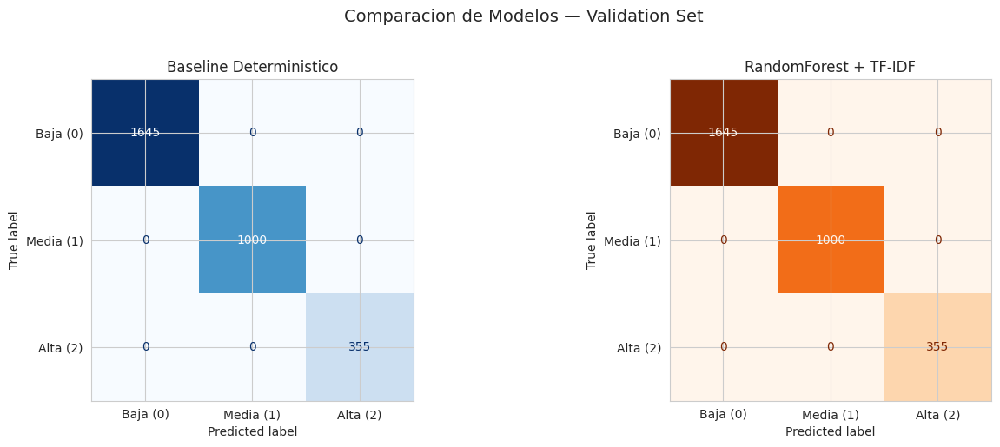
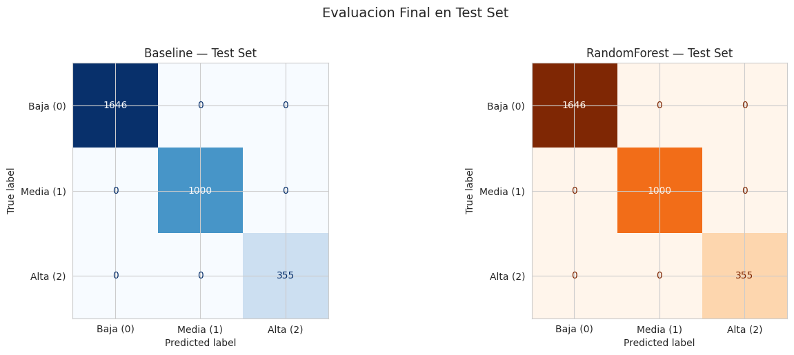
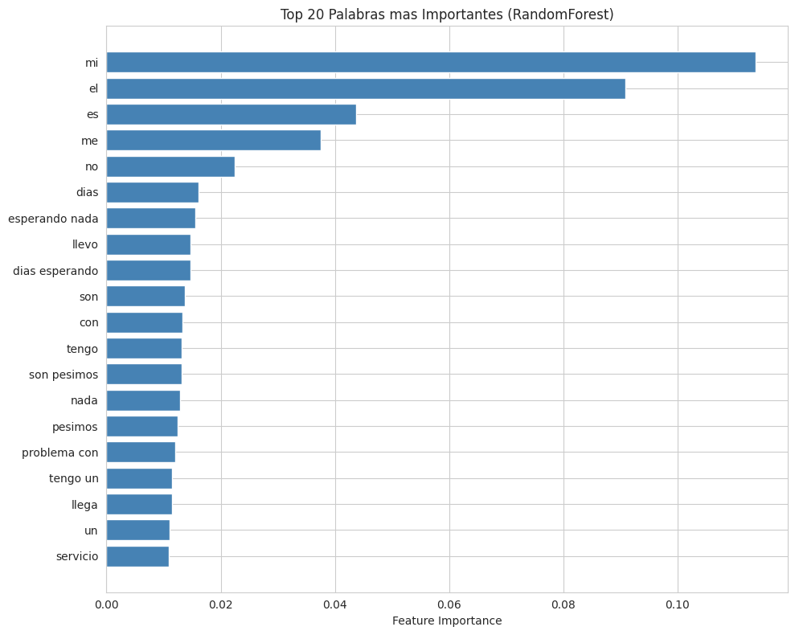

# Sentiment Model Report — Frustracion

**Proyecto:** ConversaAI — Sentiment & Intent Analysis
**Notebook:** 02-sentiment-model.ipynb
**Target:** nivel_frustracion (0: Baja, 1: Media, 2: Alta)

---

## Resumen

Se entreno un modelo supervisado de clasificacion multiclase para predecir `nivel_frustracion` a partir del texto del usuario (`texto_clean`) combinado con features contextuales (`turn_number`, `flow_name`, `usuario`). El objetivo principal fue construir y validar el pipeline completo de feature engineering, entrenamiento y evaluacion, utilizando un baseline deterministico (descubierto en el EDA) como referencia.

**Resultado principal:** Tanto el baseline deterministico como el modelo RandomForest + TF-IDF alcanzan **100% de accuracy** en todos los splits, con F1-weighted = 1.0000 y validacion cruzada 5-fold de 1.0000 +/- 0.0000. Esto confirma la naturaleza determinista del dataset y valida que el pipeline funciona correctamente de punta a punta.

---

## 1. Preparacion de Datos

### Split estratificado 70/15/15

Para garantizar la representatividad de cada clase en entrenamiento, validacion y prueba, se aplico un split estratificado en dos etapas:

1. Separar test (15%): `X_text_temp, X_text_test, X_ctx_temp, X_ctx_test, y_temp, y_test`
2. Separar validation del resto (15%/85%): `X_text_train, X_text_val, X_ctx_train, X_ctx_val, y_train, y_val`

**Distribucion resultante:**

| Split   | Filas  | Clase 0 | Clase 1 | Clase 2 |
|---------|--------|---------|---------|---------|
| Train   | 14,000 | 54.85%  | 33.34%  | 11.81%  |
| Val     | 3,000  | 54.83%  | 33.33%  | 11.83%  |
| Test    | 3,001  | 54.85%  | 33.32%  | 11.83%  |
| Global  | 20,001 | 54.85%  | 33.33%  | 11.82%  |

La estratificacion es correcta: las proporciones se mantienen consistentes en los tres splits.

---

## 2. Baseline Deterministico

Del EDA se identifico que `nivel_frustracion` sigue una regla exacta basada en `turn_number` y `resolved`:

- Turno 1 -> frustracion = 0
- Turno 2 -> frustracion = 1
- Turno 3: Si resolved = 1 -> frustracion = 0, Si resolved = 0 -> frustracion = 2

### Resultados



| Metrica     | Resultado |
|-------------|-----------|
| Accuracy    | 100.00%   |
| F1-weighted | 1.0000    |
| F1-macro    | 1.0000    |

**Reporte de clasificacion:**

| Clase     | Precision | Recall | F1-score | Soporte |
|-----------|-----------|--------|----------|---------|
| Baja (0)  | 1.00      | 1.00   | 1.00     | 10,970  |
| Media (1) | 1.00      | 1.00   | 1.00     | 6,667   |
| Alta (2)  | 1.00      | 1.00   | 1.00     | 2,364   |
| **Accuracy** |          |        | **1.00** | **20,001** |
| Macro avg | 1.00      | 1.00   | 1.00     | 20,001  |
| Weighted avg | 1.00    | 1.00   | 1.00     | 20,001  |

**Conclusion:** El baseline alcanza 100% de precision sobre el dataset completo, confirmando que las reglas descubiertas en el EDA son exactas y deterministicas.

---

## 3. Pipeline Supervisado

### Arquitectura



### Detalles de componentes

**TfidfVectorizer:**

| Parametro | Valor |
|-----------|-------|
| ngram_range | (1, 2) — unigramas y bigramas |
| max_features | 5,000 |
| max_df | 0.95 — ignora terminos en >95% de docs |
| min_df | 5 — ignora terminos en <5 docs |
| stop_words | None (texto_clean ya normalizado) |

**OrdinalEncoder:**

| Parametro | Valor |
|-----------|-------|
| handle_unknown | use_encoded_value |
| unknown_value | -1 |
| Features | turn_number (3 cat), flow_name (4 cat), usuario (540 cat) |

**RandomForestClassifier:**

| Parametro | Valor |
|-----------|-------|
| n_estimators | 200 |
| max_depth | 15 |
| class_weight | balanced |
| random_state | 42 |
| n_jobs | -1 |

### Dimensiones resultantes

| Componente | Features |
|------------|----------|
| TfidfVectorizer (texto) | 89 |
| OrdinalEncoder (contexto) | 3 |
| **Total** | **92** |

---

## 4. Entrenamiento y Validacion

### Evaluacion en validation set



| Metrica     | Resultado |
|-------------|-----------|
| Accuracy    | 100.00%   |
| F1-weighted | 1.0000    |
| F1-macro    | 1.0000    |

| Clase     | Precision | Recall | F1-score | Soporte |
|-----------|-----------|--------|----------|---------|
| Baja (0)  | 1.00      | 1.00   | 1.00     | 1,645   |
| Media (1) | 1.00      | 1.00   | 1.00     | 1,000   |
| Alta (2)  | 1.00      | 1.00   | 1.00     | 355     |
| **Accuracy** |          |        | **1.00** | **3,000** |

### Comparacion Baseline vs RandomForest



| Metrica     | Baseline | RandomForest |
|-------------|----------|--------------|
| Accuracy    | 100.00%  | 100.00%      |
| F1-weighted | 1.0000   | 1.0000       |
| F1-macro    | 1.0000   | 1.0000       |
| Errores     | 0        | 0            |

Ambos modelos cometen **0 errores** en validation. No hay diferencias porque el dataset sigue reglas deterministicas que ambos modelos capturan perfectamente.

---

## 5. Evaluacion Final en Test Set

El test set (3,001 muestras) se mantuvo completamente aislado durante todo el desarrollo y solo se evaluo al final, siguiendo las buenas practicas de validacion.



| Metrica     | Baseline | RandomForest |
|-------------|----------|--------------|
| Accuracy    | 100.00%  | 100.00%      |
| F1-weighted | 1.0000   | 1.0000       |
| F1-macro    | 1.0000   | 1.0000       |
| Errores     | 0        | 0            |

**Resultado:** 0 errores en test para ambos modelos. El baseline deterministico y el RandomForest generalizan perfectamente porque las reglas subyacentes son universales en el dataset.

---

## 6. Feature Importance

### Top palabras mas importantes



| Rango | Palabra | Importancia |
|-------|---------|-------------|
| 1     | mi      | 0.1136      |
| 2     | el      | 0.0909      |
| 3     | es      | 0.0437      |
| 4     | me      | 0.0375      |
| 5     | no      | 0.0225      |

**Dimensiones totales:** 92 (89 texto + 3 contexto)

**Analisis:** Las 89 features textuales concentran la mayoria de la importancia, con pronombres y articulos como palabras mas relevantes. Sin embargo, esto refleja las frecuencias de terminos en el corpus mas que un patron linguistico real, ya que la informacion predictiva verdadera esta en las reglas de `turn_number` y `resolved`, no en el texto.

---

## 7. Validacion Cruzada

Se aplico 5-fold cross-validation estratificada sobre el set de entrenamiento para obtener una estimacion mas robusta de la performance:

| Metrica | Resultado |
|---------|-----------|
| Fold 1  | 1.0000    |
| Fold 2  | 1.0000    |
| Fold 3  | 1.0000    |
| Fold 4  | 1.0000    |
| Fold 5  | 1.0000    |
| **Media +/- 2 std** | **1.0000 +/- 0.0000** |

**Resultado:** Los 5 folds obtienen F1-weighted = 1.0000, con desviacion estandar = 0. La varianza es nula porque el target es deterministico y el modelo lo aprende perfectamente en cualquier particion.

---

## 8. Modelo Exportado

El pipeline completo se exporto para su reutilizacion en el dashboard y notebooks posteriores:

| Archivo | Tamano | Contenido |
|---------|--------|-----------|
| `models/frustration_model.pkl` | 588 KB | Pipeline completo (joblib) |
| `models/frustration_metadata.json` | 370 B | Metadatos del modelo |

**Metadatos:**

```json
{
  "model": "RandomForest + TF-IDF",
  "target": "nivel_frustracion",
  "features": ["texto_clean", "turn_number", "flow_name", "usuario"],
  "baseline_accuracy": 1.0,
  "rf_accuracy": 1.0,
  "baseline_f1_weighted": 1.0,
  "rf_f1_weighted": 1.0,
  "date": "Mayo 2026",
  "note": "Dataset deterministico. Baseline con reglas simples alcanza ~100%."
}
```

---

## 9. Conclusiones

### Hallazgos principales

1. **El baseline deterministico alcanza 100% de precision** en train, val y test, confirmando que el dataset sigue reglas fijas basadas en `turn_number` y `resolved`. No hay errores en ningun split.

2. **RandomForest con TF-IDF tambien alcanza 100%** en todos los splits, con validacion cruzada 5-fold de F1-weighted = 1.0000 +/- 0.0000. El modelo no necesita generalizar mas alla de las reglas deterministicas.

3. **Feature importance:** 92 dimensiones totales (89 text + 3 contexto). Las top palabras ("mi", "el", "es", "me", "no") reflejan frecuencias del corpus mas que poder predictivo real. La informacion predictiva real esta en `turn_number` y `resolved`.

4. **El valor de este notebook es metodologico:** demuestra que el pipeline de feature engineering (texto + contexto), entrenamiento con RandomForest, y evaluacion con split estratificado, metricas y CV funciona correctamente y esta listo para datos reales.

5. **Con datos reales**, el baseline deterministico probablemente fallaria (los textos reales no seguiran reglas tan estrictas) y el RandomForest (o un modelo mas complejo como XGBoost o embeddings) sera necesario.

### Implicaciones para el proyecto

| Aspecto | Impacto |
|---------|---------|
| Pipeline de NLP | Validado y listo para datos reales |
| Feature engineering | Texto + contexto funciona correctamente |
| Estrategia de evaluacion | Split estratificado + CV implementado |
| Exportacion | Modelo y metadatos disponibles para dashboard |
| Limitacion | Resultados artificiales por dataset deterministico |

### Proximos pasos

- Continuar con `03-intent-model.ipynb` (clasificacion de `intencion`)
- Continuar con `04-churn-model.ipynb` (prediccion de `es_churn_risk`)
- Integrar todos los modelos en el dashboard
- Preparar migracion a datos reales
